# New-York-Restaurant-Guide

## Abstract

Every restaurant in New York City is inspected for food safety standards at a minimum of once a year, more frequently where violations are found. Health Inspections are a major source of worry for owners and managers and also a significant source of costs to a food service establishment in the form of fines and lost business where violations are found and a poor rating given. This project takes public available data published by the Department of Health through the New York Open Data program and applies Exploratory Data Analysis to extract explore and visualize trends across 3 areas of business characteristics: Location, Type and History.

Machine Learning Models are created to predict health inspection outcomes "sight unseen". Using the Location, Type and History characteristics of a restaurant it is possible to determine with ~68% accuracy whether or not that establishment will receive an A on its health inspection. Similar levels of accuracy are achieved using a larger sparse matrix of 156 categorical features and using a much smaller array of numerical summary statistics of 9 features with the latter performing a much faster training period. However, it was not possible to achieve accurate results by constructing a model trained only a subset of restaurants based in Manhattan and extrapolating the model to all of New York. These can be used as a predictive tool for "at risk" restaurants that are concerned over the possibility of losing their A rating or by restaurant industry consultants attempting to attract new clients. Additionally, this model can be used as a public safety tool for investing resources into neighbourhoods or restaurant types that are outliers for food safety to encourage better practices for food safety.

Future work expansion on these models could include additional features such as time based effects on ratings (seasonal or day of week), longer historical effects or incorporate additional data sources such as yelp reviews.

## Project Motivation
The New York City Department of Health and Mental Hygiene inspects all food service establishments to make sure they meet Health Code requirements. Adherence to Health Code food safety requirements is necessary to prevent foodborne illness after it's introduction in 2011 instances of salmonella in New York City fell by 14% in the first year (source: https://ny.eater.com/2019/6/28/18761345/department-of-health-letter-grades-nyc-restaurant-rules) but it has also generates millions of dollars in fines to restaurants. Annual totals for restaurant fines from Dept. of Health Inspections top \$30 million annually and reached \$54 million in 2012 (source: https://comptroller.nyc.gov/reports/new-york-city-fine-revenues-update/). 

Penalties for Health Code Violations are effectively twofold. Where violations are found a Notice of Violation is issued and a hearing Date is set for the Health Hearing Division of the Office of Trials and Hearings (OATH), violations can be contested and fines are determined at the OATH hearing. Fines can range from \$200 to \$2,000 and higher for repeat offences. The second form of penalty can occur if a restaurant fails to achieve an A grade. According to a 2012 survey conducted by Baruch College at the City University of New York, 88% of New Yorkers  used the letter grades in making their dining decisions, and 76% felt more confident eating in an "A" grade restaurant(source: https://www1.nyc.gov/site/doh/about/press/pr2017/pr031-17.page). Failing to achieve or maintain an A grade can result in damage to a restaurant's reputation, negative press coverage (Upscale restaurant Per Se's 2014 poor inspection result was reported on by Business Insider - https://www.businessinsider.com/per-se-grade-pending-2014-3) and a loss of customer confidence that leads to a drop in foot traffic, sales and profits. 

The importance of an A grade has restaurants bending over backwards to beat the inspectors (source: https://ny.eater.com/2019/6/28/18761345/department-of-health-letter-grades-nyc-restaurant-rules) and has led to a booming industry of restaurant consultants, performing mock inspections and legal service that will assist in challenging violations at the OATH Hearing. The ability to predict, prior to inspection, whether a restaurant is likely to receive the highly coveted A is an invaluable tool in preparing for the inspection event. 

## Inspection Process
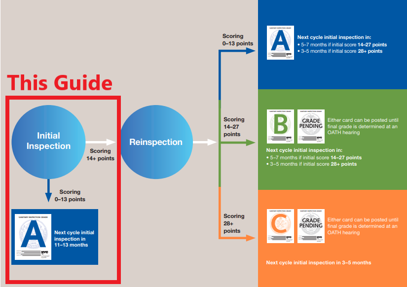

source: [Inspection Cycle Overview](https://www1.nyc.gov/assets/doh/downloads/pdf/rii/inspection-cycle-overview.pdf) 

Inspections that do not result in an immediate A are subject to re-inspection and/or OATH hearings and may still be able to obtain an A rating but the stigma associated with displaying a "Grade Pending" Sign and the costs associated with tribunal hearings and process adaptations in preparation for reinspection are costly. The ideal outcome is to receive 13 points or fewer during the inspection and immediately be able to display an A rating. Additionally, receiving an A rating allows the restaurant to have a longer period between inspections (11-13 months) than would be possible even if they receive an A through reinspection or OATH hearing. (5-7 or 3-5 months)

Every food service establishment receives an unannounced, onsite inspection at least once a year. The inspector may visit anytime the restaurant is receiving or preparing food or drink, or is open to the public. The inspector records observed violations in a handheld computer during the inspection. Each violation is associated with a range of points depending on the type and extent of the violation, and the risk it poses to the public. At the end of the inspection, the points are added together for an inspection score. Lower inspection scores indicate better compliance with the Health Code.

Health Code violations are classified as 'Critical' or 'General'. Critical violations are more likely to to contribute to foodborne illnesses and are a substantial risk to public health.

A score of 13 points or less results in an A rating. Receiving Critical violations will not immediately put a restaurant over the 13 points necessary to receive an A grade and likewise it is still possible (but very rare) to receive more than 13 points on general violations alone.

A detailed description of all Critical and General Violations can be found here: [The Blue Book](https://www1.nyc.gov/assets/doh/downloads/pdf/rii/blue-book.pdf)

## The Data
The New York City Open Data Project records of every violation citation up to three years prior to the most recent inspection for all active restaurants within the city

source : https://data.cityofnewyork.us/Health/DOHMH-New-York-City-Restaurant-Inspection-Results/43nn-pn8j

More information on this data: 
https://github.com/ktzioumis/New-York-Restaurant-Guide/blob/master/About_NYC_Restaurant_Inspection_Data_on_NYC_OpenData_092418.docx 
https://github.com/ktzioumis/New-York-Restaurant-Guide/blob/master/RestaurantInspectionDataDictionary_09242018.xlsx

Data for this project was pulled on the 17th of August 2019 and is up to that date. 

Github Notebook: https://github.com/ktzioumis/New-York-Restaurant-Guide/blob/master/Inspection_Dataframe_construction.ipynb

The full dataset records individual violation citations for all Dept of Health inspections including those that are not related to food safety and are not graded/scored. Each violation is a row within the dataset recording the identifying the violation code and description  and features for the restaurant (CAMIS:unique identifier, name, location, cuisine type) and the inspection (type of inspection, date, total inspection score). 
To perform Exploratory Data Analysis the data was cleaned in the following steps:
- The dataset was reconfigured in Pandas to group violations into inspection events based on CAMIS identifier and date.  
- "Initial Inspections" were extracted. These are the regular Dept of Health food safety inspections
- The inspection Score was determined from the violations
- Violations were encoded categorically 
- Grade was missing in many cases (for various reasons) and was determined from inspection Score:
    - A <=13
    - B 14 to 28
    - C > 28
- Critical flags are summed for the inspection based on the violations recorded and encoded in a feature
- Inspections from prior to mid 2016 were dropped as these represent a very sparse set of inspections compared to the main set

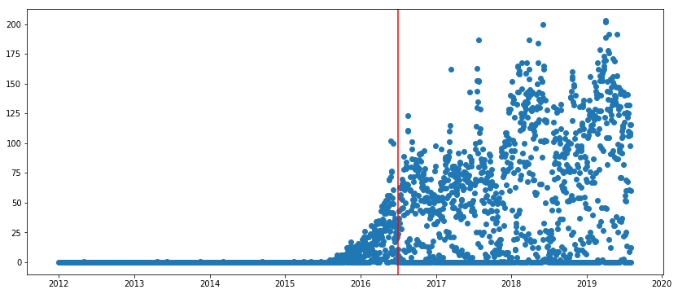

- Inspections from after to the 20th of July 2019 were also dropped as these have not yet been finalised by OATH hearing leading to a significantly higher average
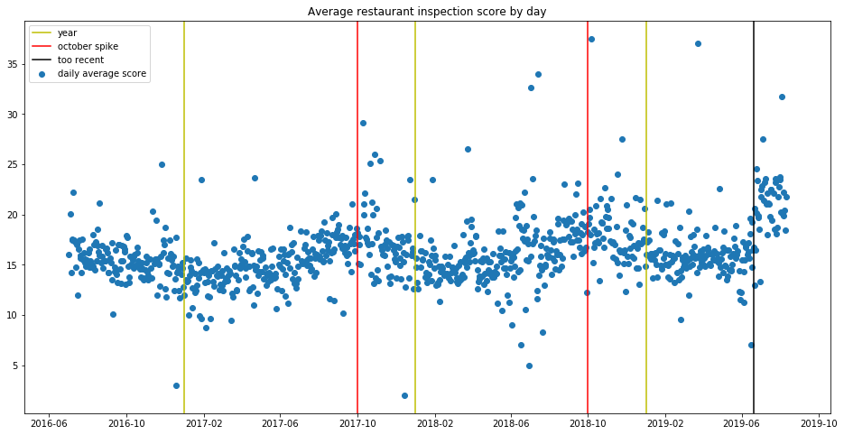

Some cyclical effects on inspection average were observed but the time scale is very short to extract annual cyclical effects and this was not further explored in this project but is included in future work.

All further analysis was performed based on this initial inspection data

## Initial Inspection Analysis
Github Notebook https://github.com/ktzioumis/New-York-Restaurant-Guide/blob/master/Initial_inspections_analysis.ipynb

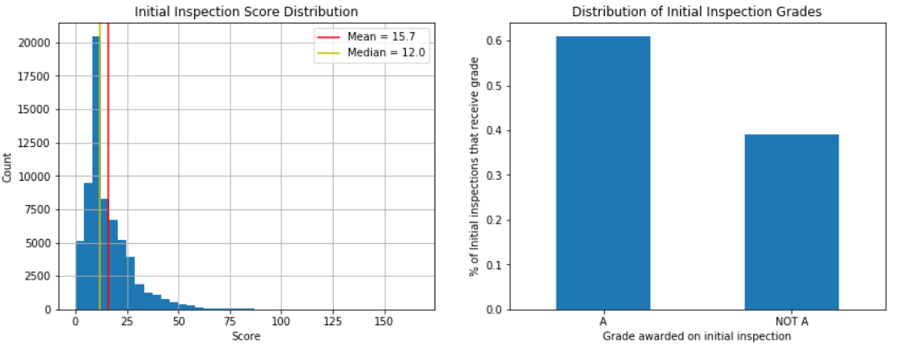

Approximately 60% of all initial inspections result in an A rating.The distribution of initial inspections scores is left skewed with a long tail. The median score is 12 which is an A rating however the long tail drags up the mean to 15.7 which is a B rating. The distribution peaks sharply just before the A cutoff, inspections are at least partially subjective and inspectors have leeway when awarding points and violations. Inspectors appear to be more inclined to give a restaurant a "just made it" A over a "just missed it" B 

Scarily, the highest Score recorded in an inspection in this time period was <b>166</b> and the establishment was shut down.

### Violation Correlation

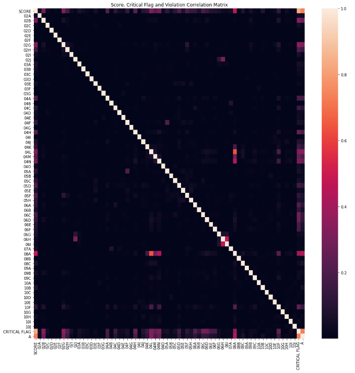

The overall heatmap is very hard to read and the overwhelming majority of violations correlate only weakly with score. A tighter focus is taken on only the features that have a correlation factor with Score of over 0.3

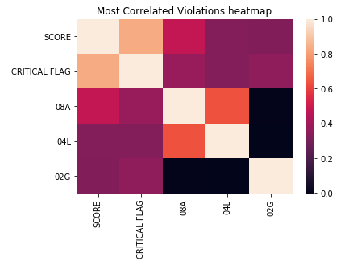

No individual violation correlated very strongly with score which indicates that violations are spread and restaurants are not all constantly tripping up over the same violation. Critical flags are the most serious types of violations, the sum of critical flags for an inspection correlates strongly with Score as these are dependent measures.

### Critical Flags

Critical Flag violations present a more serious risk to public health and safety and are scored higher than general violations. For example, storing cold food items above 41 deg F allows harmful bacteria to grow and is a critical violation, not posting a "wash hands" sign in the restroom is a general violation.

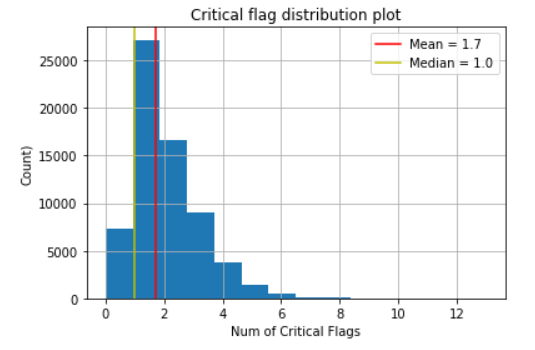

The distribution of critical flags is left skewed with most establishments manage to receive just 1 or 2 critical flag violation on their inspection (median = 1 and mean= 1.7) however the distribution for critical flag violations has a long tail with the highest number of critical violations received during an inspection being <b>13</b> (this establishment was also shut down)

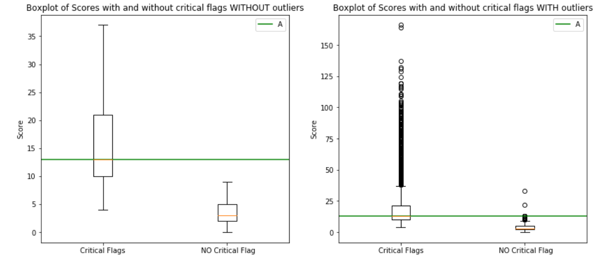

Although it is no easy feat, not receiving any critical flag violations virtually guarantees an A. 99.97% of all inspections that do not result in a critical flag violation are awarded an A grade. Those restaurants that do receive critical flag violations on their inspections are still very capable of receiving an A grade and the median score for is 13 which is a passing A grade. 

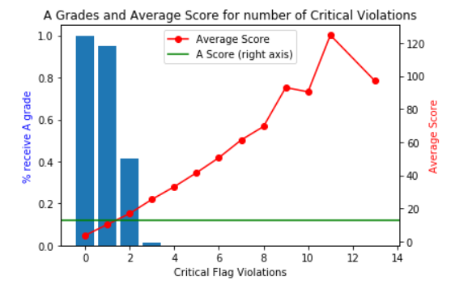

Although critical flag violations are considered a serious risk to public health a single critical violation is also very likely (95% chance) to result in an A grade. Once a restaurant passes this threshold however their chances of an A drop off significantly and just 41% of restaurants that receive 2 critical flags are awarded an A grade.

### Vermin

5 vermin related violations were identified:
- evidence or presence of 
    - rats (04K)
    - mice (04L)
    - cockroaches (04M)
    - flies (04N)
- lack of "vermin proofing" (08A)

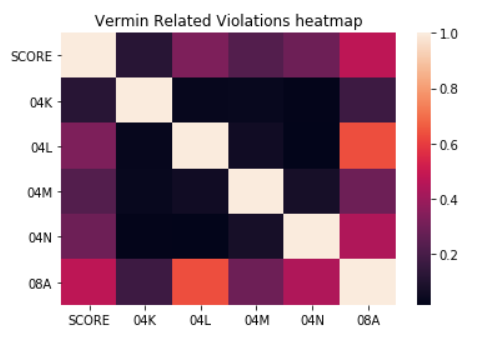

Each violation correlated  weakly with other vermin types which indicates it is rare for restaurants to have multiple vermin infestations but rather vermin related violations tend to be isolated events. Violations for lack of vermin-proofing are non-critical and are the most common. 

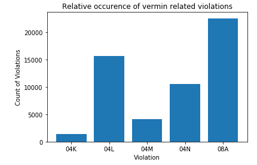

Rat related violations are the least common and mice are the most common. Is New York's famous rat problem really a mouse problem? Or are inspectors unable to distinguish between evidence of the presence of mice and rates (bitten bags, droppings, etc) and are more likely to attribute such violations to the less serious (or at least less serious sounding) mice violation?

## 3 Categories Breakdown 

The features of restaurants related to the health inspection score are grouped into three categories: 
- Location - Where the restaurant is in New York 
- Type - The distinguishing features of the Restaurant itself
- History - How the restaurant has performed on it's past inspection

After reconstructing the inspection data around CAMIS and Date to group by inspections rather than individual violations, the restaurant data was also isolated by CAMIS and this was merged with the inspection data 

github notebook https://github.com/ktzioumis/New-York-Restaurant-Guide/blob/master/Merged.ipynb

### Location

New York City can be divided up in a variety of ways for this project I have used Community Boards to break up the city and draw location based trends. There 69 Community Boards including Joint Interst Areas such as Central Park in Manhattan
https://en.wikipedia.org/wiki/Community_boards_of_New_York_City

#### Community Board
Github Notebooks: 
https://github.com/ktzioumis/New-York-Restaurant-Guide/blob/master/Restaurant_Data_Isolation.ipynb
https://github.com/ktzioumis/New-York-Restaurant-Guide/blob/master/Community_Board_Investigation.ipynb

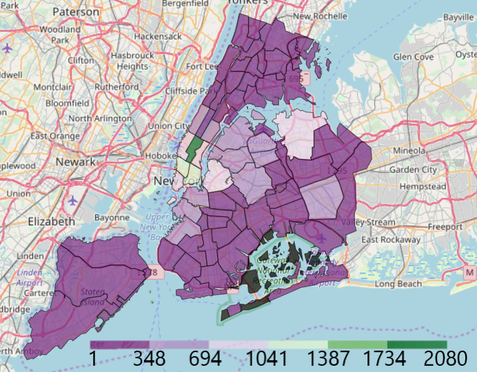 

<b>Restaurant Density Map</b>

Restaurants are spread throughout New York but are at their most concentrated in Midtown and Lower Manhattan

The different preferences and ethnic make-up of Community Boards can also be visualised by their most popular restaurant type

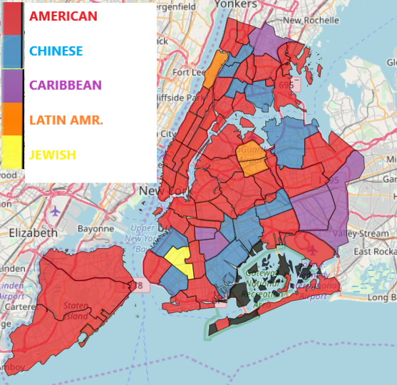

<b> Most Popular Cuisine Style by Community Board </b>

We can also visualise the average inspection score for each Community Board

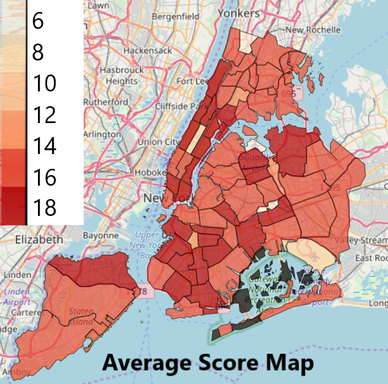

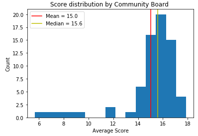

The distribution of average scores across community boards is normally distributed about a mean of 15 with a few outliers with low scores. 

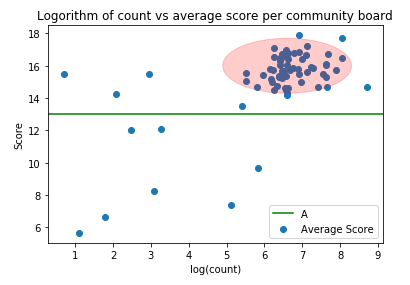

On the Scatter plot there is a visible cluster of points with high restaurant counts and high average scores, this is the standard most community boards are achieving.
Unfortuantely it doesn't appear that the best food safety practices are in the most restaurant heavy neighbourhoods. 

### Restaurant Type
Github Notebook https://github.com/ktzioumis/New-York-Restaurant-Guide/blob/master/Restaurant_Type.ipynb

#### Cuisine Description

There are 84 different cuisine descriptions attached to the restaurants inspected by taking the average score for inspections for cuisine styles we can view a distribution

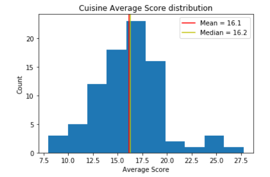

The lowest scoring cuisine styles are mostly simple things like hotdogs and nuts/confectionary where the smaller scope of cooking/preparation most likely makes it significantly easier to adhere to the city food safety standards

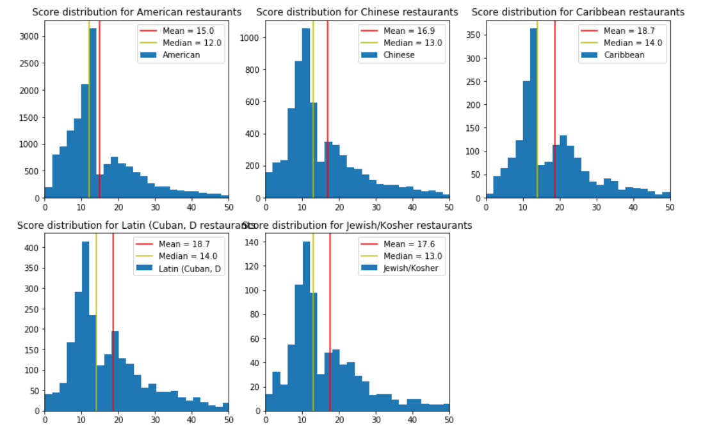

The cuisine styles that were most popular in Community Boards are given a distribution above. Interestingly all appear to bimodal with a peak just before the A grade cutoff and another in the higher teens. The tendency for inspectors to give restaurants that 'just made it' A instead of a 'just missed it' B creates a "Valley of Leniency"

#### Chain

Restaurants with more than one location operating under the same business name are classed as a chain for the purposes of this project. Popular chains have many locations across the city and have set practices and training programs that govern their food safety across all their outlets. This can lead to better food safety outcomes and lower inspection scores

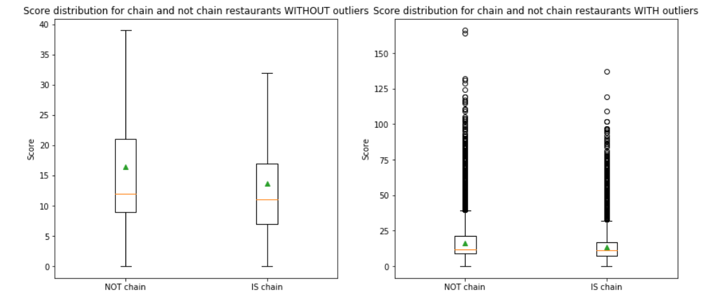
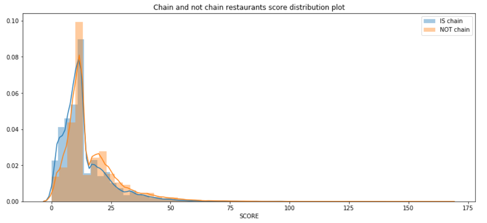

To verify this statistically I have used a 2 sided Welch's T-test with unequal variance:

h0: null hypothesis: the two populations have equal means
h1: alternate hypothesis: the two populations have unequal means

Let our p-value threshold to reject the null hypothesis be 0.05

Our calculated p-value is 1.3e-184 - much lower than our threshold so we reject the null hypothesis. 

### History
Github Notebook https://github.com/ktzioumis/New-York-Restaurant-Guide/blob/master/Twice.ipynb

#### Previous Inspection Score 

The dataset covers approximately 3 years and each restaurant is inspected on a minimum of yearly basis so we expect there to be multiple inspections available for all restaurants excepting those that have been open for less time than their reinspection cycle

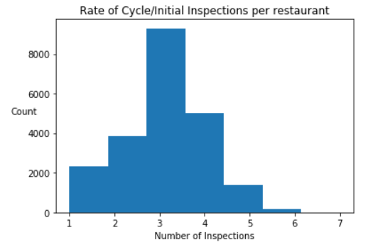

The small subsection of restaurants that have only been inspected once are excluded from this analysis. Of the remaining inspections the inspection score and number of critical flags from the same restaurant and latest prior date was added as a feature of the dataset.

Score and previous score correlated more weakly than expected at just 0.23. This would indicate that restaurants are not necessarily 'stuck in a rut'. Improvement and disimprovement occur at an equal rate.

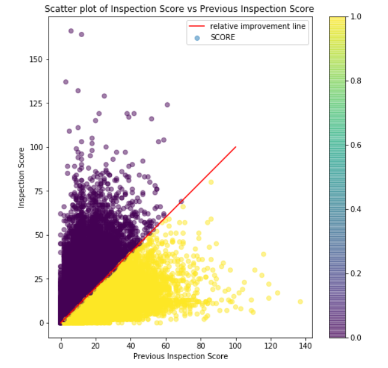

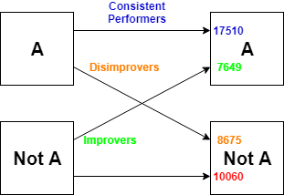

The most common scenario is for an A rated restaurant to maintain its A, however, more than a third of all inspections result in a change of grade in either direction

#### Previous Inspection Critical Flags

The number of critical flags received on an inspection likewise correlated weakly across subsequent inspections at just 0.27. 

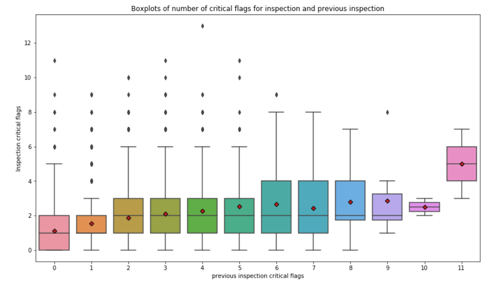

Poor inspection performance and fines do not necessarily teach an establishment their lesson. It may be necessary to improve or re-think the penalty system for health code violations to ensure that process improvements are made and kept in place.

## Machine Learning

Machine Learning was used to create an A grade predictor. A matrix was created using the features explored above for Type, Location and History. The problem was approached in 3 different fashions outlined below. All are binary Classifier models for an A grade

### Categorical Matrix
Github Notebook https://github.com/ktzioumis/New-York-Restaurant-Guide/blob/master/Sparse_matrix_classifier_3_prev_score.ipynb

The features for Cuisine Description and Community Board are one-hot encoded from the categorical features to create a sparse binary matrix. Existing binary feature is_chain is also added and the features for previous inspection score and previous inspection which are continuously numerical.

An baseline is created using an ADABoost Classifier  that achieves an accuracy of 64%. Improvements on the model are made by resampling the data using SMOTE techniques to remove weight bias from the target sample weights and using a grid-search with 3 fold cross validation and XGBoost Classifier as the estimator to give a best estimator with an accuracy and score of 68%

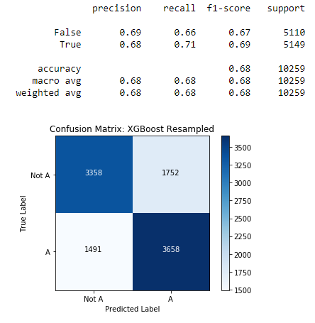

### Summary Statistics 
Github Notebook https://github.com/ktzioumis/New-York-Restaurant-Guide/blob/master/Summary_Stats_Classifier_Model_2_prev_score.ipynb

Using a different approach from the above model, categorical features from the Cuisine Description and Community board are substituted for the summary statistics for each categorical entry. The Cuisine Description and Community Board mean standard deviation and overall count for each entry are used. The numerical features for previous score and previous critical violations are also used as well as the is_chain binary feature. This creates a significantly smaller matrix than the one used above reducing the number of features from 156 to 9. 

A baseline accuracy is established using a simple Logistic Regressor giving an accuracy of 63%. The model is improved by resampling using SMOTE techniques to remove bias due to target sample weight and applying a standard scaler to all features to prevent artificial weighting of features. The Classifier is also optimised using grid-search with 3 fold cross validation and XGBoost Classifier is used and accuracy is improved to 67% with a score of 68%

An equal level of accuracy was achieved using summary statistics as one-hot encoded categorical features with a big improvement in training time. The training time for the one-hot encoded sparse matrix for the best XGBoost estimator is 16 seconds whereas the training time for the summary statistics matrix best XGBoost estimator is just 1.5 seconds, one tenth of the time. This reduction in training time with no loss in accuracy makes the Summary Statistics learning model much more agile for a deployed algorithm that will need to be retrained regularly as need data become available.

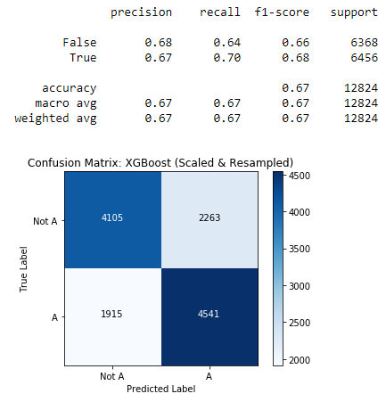

The Classifier relies previous score the most heavily followed by the cuisine style average and status of is_chain.

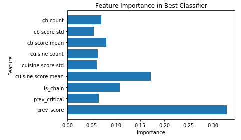

### Manhattan Only Statistics
Github Notebook https://github.com/ktzioumis/New-York-Restaurant-Guide/blob/master/Manhattan_model_Classifier_2_prev_score.ipynb

The summary statistics method above was also used on smaller subsection of the restaurant inspection data representing only Manhattan. The same level of accuracy was possible again using a resampled and scaled feature matrix and a grid-search with 3 fold cross validation to optimise an XGBoost Classifier. This again achieved notable improvements in training time but the Manhattan trained model performed very poorly when classifying the full dataset with other boroughs included. The use of Manhattan as a representative sample appears to be a flawed premise and I would caution against extrapolating any model trained only on Manhattan data to a broader geographical area.

## Keras Deep Learning

A deep learning neural network was built using Keras to further improve up accuracy of the machine learning models. Accuracy on par with the XGBoost Classifiers was not achieved and overfitting occurred quickly. Further development in this area is considered in Future Work

## Conclusions

New York restaurants are subjected to regular inspection by the Dept. of Health to ensure food safety standards are adhered to and award grades to restaurants based on their performance in the insepection. Where health code violations are found, fines are levied on the offending restaurant and sufficient tally of violations will result in B or C grade which can damage an establishment's reputation and cause a loss of business. 

Approximately 60% of all regular health code inspections receive an A grade and the scores awarded are approximately normally distributed with a left skew and long right tail. The long tail of a few very high scores drag up the average for inspections and can be misleading when looking at the data overall. The success in achieving a high standard of food safety by the clear majority of restaurants in New York is encouraging to me as a resident.

Restaurant characteristics were broken down by Location, Type and History. 

Inspection scores across cuisine styles vary greatly with simpler types of cuisines that involve less or simpler prep achieving lower average scores. Across popular cuisine styles it observable that inspections scores follow a bimodal distribution as inspectors apply discretion or restauranteurs apply pressure to scoring; the number of "just missed it" scores just over the A threshold appears artificially few. Additionally the existence of multiple locations has a positive effect on score these establishments are more likely to have more formal staff training and can least afford the loss of reputation across their whole business should their outlets not receive an A. However, there may also be correlation between chains and simplicity of cuisine, this is not investigated in this project. 

New York is broken up into Community Board areas and each of these is mapped with its corresponding average score. The number of restaurants in a Community Board vary greatly so the logarithm is taken for a comparison with score. A cluster is evident where the majority of Community Boards have a moderate to high number of restaurants also have an average score well above the A threshold.

The score and grade awarded on inspection do not correlate very strongly with the score or grade awarded on the prior inspection. Most restaurants that receive an A are able to maintain that A in the next inspection and this is the most common outcome across 2 inspections However it is very much possible and commonplace for restaurant to receive a different grade, either by improving to an A or disimproving from an A and no establishment is in a position to rest on its laurels in regard to food safety.

By extracting features based on Restaurant Type, Location and History I was able to construct a predictive classifier using XGBoost that is able to predict whether a restaurant will achieve an A grade on an inspection with 68% accuracy. I believe this to be a very useful tool for restaurants wishing to prepare for an upcoming inspection and for restaurant consultants that are seeking new business to be able to advise on the prospect of an A grade. The importance of an A grade is within the restaurant business in New York is high with 88% of New Yorkers reporting that it influences their decisions when dining out. This predictive model may allow a restauranteur to forewarned and therefore forearmed (to paraphrase a proverb).

This is a surprisingly high level of accuracy for a prediction that does not involve setting foot into a restaurant. The importance of cuisine style within the model may give rise to questions of bias by inspectors toward foreign or specialty cuisine styles where they are not familiar with the preparation method such as the case of the Chinatown Duck (https://opencitymag.aaww.org/the-roast-duck-bureaucracy/). More potential conversations about food safety standards may be needed and this analysis and predictive model may be able to shine a light on where those conversations should take place

## Future Work

Improvements to the classifier model my be possible through a number of means:
- More data. Restaurants are inspected literally every day, any predictive model should keep abreast of newest available data
- Time Series analysis.
    - Year on Year or seasonal effects are not investigated in this model although they do appear to be evident in the scatter plot of average inspection scores over time with an uptick around the month of October.  
    - Day of week effects may be evident, inspectors may be prone to Monday-itis or be mentally checked out on a Friday, however this may not be of use to the predictor as there is no way of knowing advance the day of the week an inspector will arrive on
- Variable inspection history. This model requires the existence of at least one prior inspection but does not consider further back than that. To be able account for new restaurants with no inspection history would make this a must-use tool for anyone looking to open an restaurant in New York. Conversely, using multiple prior inspections may improve accuracy for well established restaurants
- Vermin-by-distance. Using this data it would also be possible to locate clusters of vermin related violations and allow the city or restauranteurs to better take steps to prevent infestation.

